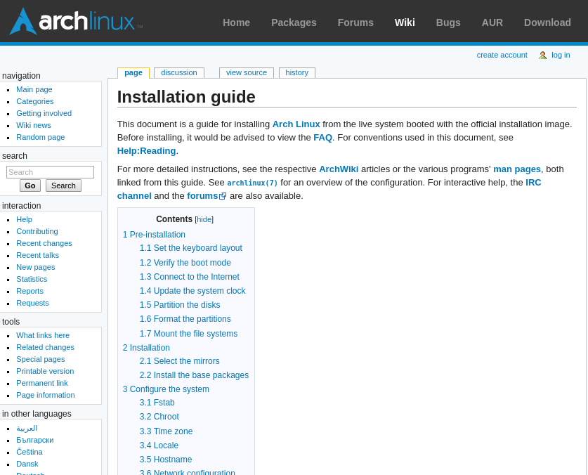
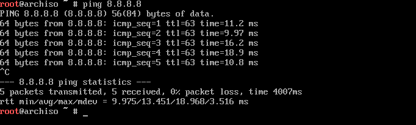
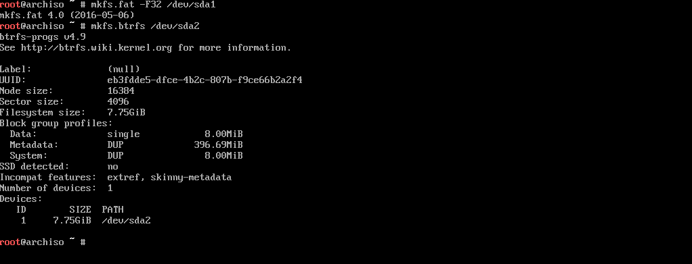
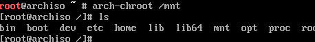
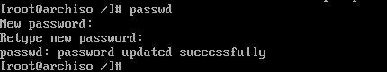

% Conquering Linux
% Robin McCorkell
% 2017-01-25


# The Fun™ Begins

For more details, check out the Arch Wiki - Installation guide



# Step 1: Keyboard

Default is a US QWERTY layout

For UK keyboards:

```
$ loadkeys uk
```

# Step 2: Internet

Installation needs an internet connection, let's test it

```
$ ping 8.8.8.8
```



# Step 3: Storage

## Device files

Hard drives, SSDs, USB drives etc. are usually `/dev/sdX`

Our HDD is on `/dev/sda`

Partitions exist as `/dev/sdXN`, e.g. `/dev/sda1`, `/dev/sda2` etc.

## Partitioning

```
$ cgdisk /dev/sda
```

1) Start 2048 (default), end 256M, type `ef00`
2) (under partition 1): use all defaults (100% size, Linux
partition)


## Formatting

```
$ mkfs.fat -F32 /dev/sda1
$ mkfs.btrfs /dev/sda2
```



## Mount the partitions

For installation, mount everything under `/mnt`

`/dev/sda2` will be the root filesystem:

```
$ mount /dev/sda2 /mnt
````

`/dev/sda1` will become `/boot`:

```
$ mkdir /mnt/boot
$ mount /dev/sda1 /mnt/boot
```

# Step 4: Installation

## Copy files

Do the install:

```
$ pacstrap /mnt base
```

Generate `/etc/fstab`:

```
$ genfstab -U /mnt >> /mnt/etc/fstab
```

# Step 5: Configuration

## Chroot into new system

`/mnt` now has a ready system, switch to it:

```
$ arch-chroot /mnt
```



## Passwords

Set root password:

```
$ passwd
```



## Locales

Edit `/etc/locale.gen` and uncomment desired locales: probably
`en_GB.UTF-8 UTF-8`.

Generate locales:

```
$ locale-gen
```


## System language

Set the default locale in `/etc/locale.conf` (create it):

```
LANG=en_GB.UTF-8
```

## Timezone

Set the system timezone with the `/etc/localtime` symlink

```
$ ln -sf /usr/share/zoneinfo/Europe/London /etc/localtime
```

## Console keymap

Set the keymap permanently in `/etc/vconsole.conf`:

```
KEYMAP=uk
```

## Networking

Create `/etc/systemd/network/enp0s3.network`:

```
[Match]
Name=enp0s3
[Network]
DHCP=yes
```

Enable required services to run on boot:

```
$ systemctl enable systemd-networkd systemd-resolved
```

## Bootloader

```
$ bootctl --path=/boot install
$ cp /usr/share/systemd/bootctl/arch.conf /boot/loader/entries/
$ cp /usr/share/systemd/bootctl/loader.conf /boot/loader/
```

Edit `/boot/loader/entries/arch.conf`:

```
title Arch Linux
linux /vmlinuz-linux
initrd /initramfs-linux.img
options root=/dev/sda2 rw
```

##

Now exit the chroot:

```
$ exit
```

Create a final symlink needed for networking:

```
$ ln -sf /usr/lib/systemd/resolv.conf /mnt/etc/resolv.conf
```

Unmount partitions:

```
$ umount -R /mnt
```

Reboot!

# Step 6: Boot

##

Username is `root`


## Test the system

```
$ ping 8.8.8.8
$ ping google.com
```

# Achievement Complete

Where can you go from here?

* Install a GUI (xfce4, kde, gnome3, ...)
* Run a web server
* Set up network attached storage
* Take over the world
* Turn a Raspberry Pi into a media system
